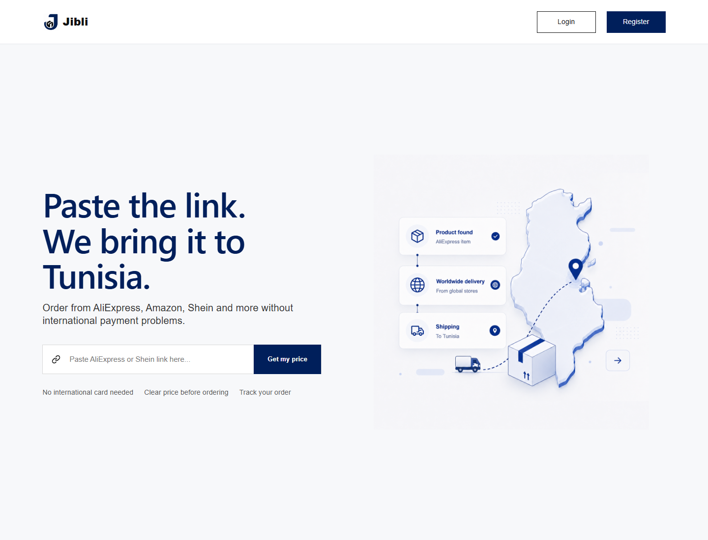
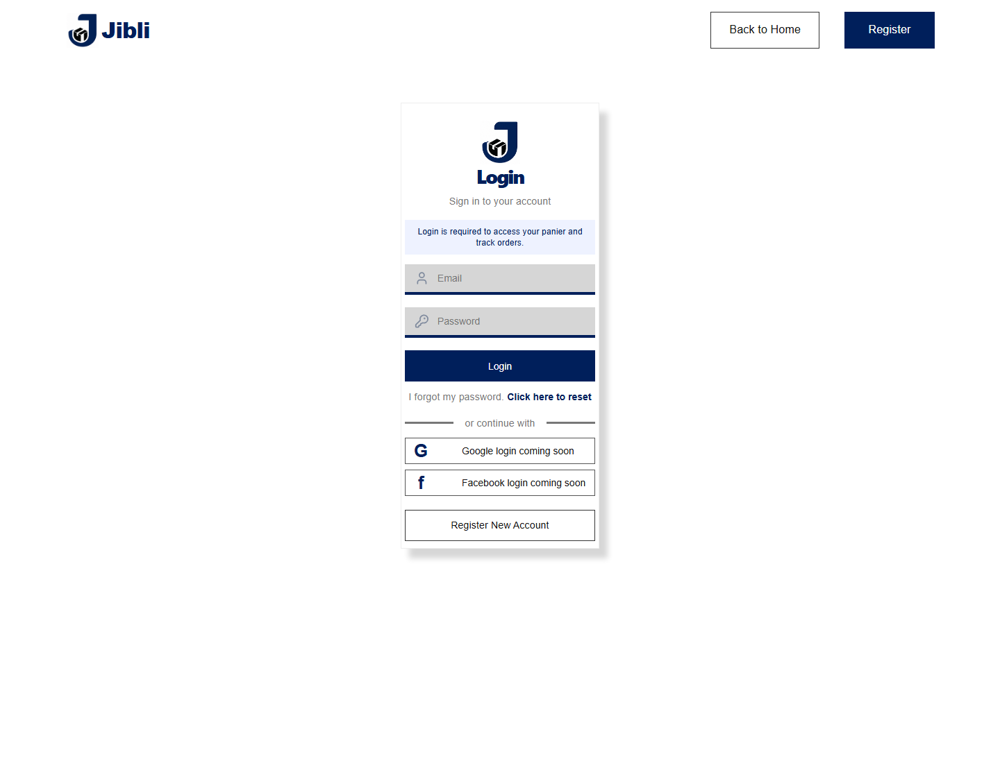
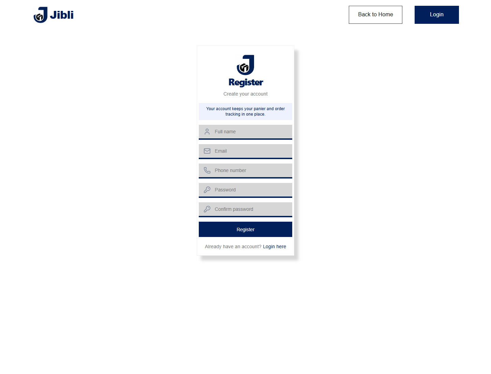

# Jibli

Jibli is a Tunisia-focused shopping assistant for ordering products from sites such as AliExpress and Shein without needing an international payment card. Users paste product links, submit their contact and delivery details, send the request to the admin on WhatsApp, and then track confirmed orders from their account.

The project is split into a React/Vite frontend, a FastAPI backend, and Supabase for authentication and data storage.

## Screenshots

### Home



### Login



### Register



## Features

- Public landing page with product-link entry.
- Email/password authentication through Supabase.
- Optional Google and Facebook login flags.
- Protected account, request, panier, tracking, and admin routes.
- AliExpress direct order requests.
- Shein shared panier progress toward a 129 USD target.
- WhatsApp handoff to the admin after saving the request.
- FastAPI endpoints for profiles, carts, orders, admin order management, and product previews.
- Admin dashboard for confirming requests, updating order status, setting final prices, adding deposit/tracking details, and deleting orders.
- Supabase SQL schema included in `supabase/schema.sql`.

## Tech Stack

- React 19
- TypeScript
- Vite
- React Router
- Supabase Auth and database
- FastAPI
- Uvicorn
- Python Supabase client

## Project Structure

```text
Jibli/
  backend/              FastAPI API, backend config, and admin scripts
  docs/screenshots/     README screenshots
  public/               Static frontend images
  src/                  React frontend source
  supabase/             SQL schema and migration helpers
```

## Frontend Setup

Install dependencies:

```bash
npm install
```

Create `Jibli/.env.local`:

```env
VITE_SUPABASE_URL=https://your-project-id.supabase.co
VITE_SUPABASE_PUBLISHABLE_KEY=your-supabase-publishable-key
VITE_API_URL=http://127.0.0.1:8000
VITE_ENABLE_GOOGLE_LOGIN=false
VITE_ENABLE_FACEBOOK_LOGIN=false
```

Run the frontend:

```bash
npm run dev
```

The app runs at:

```text
http://localhost:5173
```

## Backend Setup

Create and activate a virtual environment:

```bash
cd backend
python -m venv .venv
.\.venv\Scripts\Activate.ps1
pip install -r requirements.txt
```

Create `backend/.env`:

```env
SUPABASE_URL=https://your-project-id.supabase.co
SUPABASE_SERVICE_ROLE_KEY=your-service-role-key
FRONTEND_ORIGIN=http://localhost:5173
```

Run the API:

```bash
uvicorn app.main:app --reload
```

The backend runs at:

```text
http://localhost:8000
```

API docs are available at:

```text
http://localhost:8000/docs
```

## Supabase Setup

1. Create a Supabase project.
2. Enable email/password authentication.
3. Run the SQL in `supabase/schema.sql` from the Supabase SQL editor.
4. Put the public Supabase key in `Jibli/.env.local`.
5. Put the service role key only in `backend/.env`.

Do not expose the service role key in frontend code.

## Admin Access

The frontend admin check is configured in `src/admin.ts`. Update `ADMIN_EMAIL` if you want a different admin email.

To create or repair the admin user from the backend:

```bash
cd backend
.\.venv\Scripts\python.exe scripts\create_admin.py
```

To verify required Supabase tables:

```bash
cd backend
.\.venv\Scripts\python.exe scripts\check_schema.py
```

## Useful Scripts

```bash
npm run dev      # start the Vite dev server
npm run build    # type-check and build the frontend
npm run lint     # run ESLint
npm run preview  # preview the production build
```

## Main Routes

- `/` - public landing page
- `/login` - sign in
- `/register` - create an account
- `/request` - submit product links and delivery details
- `/tracking` - view confirmed orders and statuses
- `/account` - manage profile details
- `/admin` - admin order dashboard
